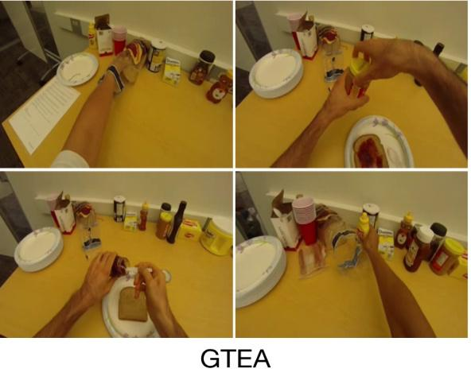

# VisionRD AI Hackathon 2024 🧠💻

Welcome to the **VisionRD AI Hackathon 2024** repository! This repo contains all the scripts, architectures, and utilities you'll need to build powerful AI models during the hackathon.

---

## 🏗️ Repository Structure
```plaintext

VisionRD-AI-Hackathon-2024/
│
├── data/                         # Place datasets here
├── arches/backbone               # Backbone architectures (ResNet, RegNet, DLA)
├── utils/                        # Utility scripts for data visualization and model visualization
├── requirements.txt              # Python dependencies
└── main.py                       # Entry point script            

```
---

<div style="display: flex; align-items: center;">

<div style="flex: 1; padding-right: 10px;">
  
### Dataset: GTEA (Georgia Tech Egocentric Activity)

The **Georgia Tech Egocentric Activities (GTEA)** dataset contains seven types of daily activities, such as making a sandwich, tea, or coffee. Each activity is performed by four different people, resulting in a total of 28 videos. 

#### Key Details:
- **Number of Videos:** 28
- **Activity Types:** Seven types of daily tasks.
- **Annotations:** Approximately 20 fine-grained action instances per video (e.g., *take bread*, *pour ketchup*).
- **Duration per Video:** ~1 minute.

For more details, refer to the GTEA dataset [website](https://sites.google.com/view/gtea/). Videos should be downloaded separately as instructed.

1. **Download the dataset** using the commands provided.

label link : [labels](https://drive.google.com/drive/folders/1WLRThi__ScZdeQQfCOfNDL5xpvo-YUd4?usp=sharing)
   
a) Frames
```bash
curl --header 'Host: drive.usercontent.google.com' --header 'User-Agent: Mozilla/5.0 (X11; Linux x86_64) AppleWebKit/537.36 (KHTML, like Gecko) Chrome/131.0.0.0 Safari/537.36' --header 'Accept: text/html,application/xhtml+xml,application/xml;q=0.9,image/avif,image/webp,image/apng,*/*;q=0.8,application/signed-exchange;v=b3;q=0.7' --header 'Accept-Language: en-US,en;q=0.9' --header 'Cookie: SID=g.a000qwiaJlolXbhN11L5-H1WXFBFzNWynLvRmc36IuMnFeHFcQcJUeTloFCEe7csMRCAC79wYAACgYKAdISARESFQHGX2Mi8kfom36lGieNggp7k9XZ-hoVAUF8yKrR74DzXMHxwXbiw_sJM9GQ0076; __Secure-1PSID=g.a000qwiaJlolXbhN11L5-H1WXFBFzNWynLvRmc36IuMnFeHFcQcJqvTk_JbtNxTJMaSJW9bPYgACgYKAdYSARESFQHGX2MiP_vO50mk522Qiv_a8jBmWRoVAUF8yKp2syVnKs000m6difZzdaM40076; __Secure-3PSID=g.a000qwiaJlolXbhN11L5-H1WXFBFzNWynLvRmc36IuMnFeHFcQcJlKkmlLflGfj00nLkQ4lskQACgYKASISARESFQHGX2Miv7f-atLek2THp1522xvB9BoVAUF8yKrdcBFMxgrssRFQGuS6MA1y0076; HSID=ArsKQ29liLTmosFId; SSID=ADAcNUyjTopvSdCpp; APISID=xumKUawauVNa1nL7/AIlYQ2yCpFALNogGh; SAPISID=JiK0-V6SMLHT5NzR/ArS3sFRHrpOhbnrug; __Secure-1PAPISID=JiK0-V6SMLHT5NzR/ArS3sFRHrpOhbnrug; __Secure-3PAPISID=JiK0-V6SMLHT5NzR/ArS3sFRHrpOhbnrug; AEC=AZ6Zc-V0Yh-_mNLx4X_bEXoJHzh2rp2To3AGDpFWQLnCinZEqdQ0RVviDw; NID=519=to_AOBz2J2hHPmOnN4KbxKj9t-d1iwLTE7hwf1SmylwxS2tvXAneWtEAI6sLeUANqRTgP5VxkxXvE9eDT3kKUubzSBh1x7A2ysD_btdXqfOakBlHw20gxiiTqhF7iVGLARDlfff8nyrRflGbc7TiLLKl5baCUCVV-g-hY28CY6E3k400fE3-07L4t0EvZEtXnya1nUBXQ3Z9j83hRCSWiihEqhGsVt0mPJy7u73RXu_Yt-D3qtCM-iEkMUrXeBk5W6gJj6zLVTeSENXINxjr3m2V_kx5hyCxhni3oZo0vUr2E7s9ATEGBr2vEOQ9UAWHIE0V6JLofi6exSzoaq60MIYo0izSeglbH0GK6VTTc8X3ZisS3rJ2rliWBgT0hZA4v6VDI2OdCNgOJ3jKbqPwLRTCfUdpe6yCo7cLl8jZa37vp8tf7txzO2KrP9Y4eHZJMIseVrNRRFjVJaprP481bDrrDAawEacLRXPplIp0JQwBY8i0m-f7E_U7rXdrhs8azp0OM7xC_xHK6FX_NecY1iGFH81YpjjMgNvwpbHOupasPRZf70BnRGsWVNgOdO9CWdE0wZH3iR46BVcilzAW4N7GzsAuKslXdthss_UIAnr2Lrl6np_K_gCWyuAGXpZcEpdwyQk25DyKSh-tR6w_Nd3yF0pgt9z-58sdu9JzAfkHXH9gxSmojAjLaO8UtzFhph-4V0B3qvSouKam-uV5PUmgKVD7aoW5dvDmisHRsdCWBM7AIgns5SEbIzLmmXNu7vCVO3IRLP8SyS8V; __Secure-1PSIDTS=sidts-CjIBQT4rX2CRK8ZeyTUVRg1saJAdlX2-RLtRCfSHkYHjnbdmadegdLYN6EP1jq3QIc6iChAA; __Secure-3PSIDTS=sidts-CjIBQT4rX2CRK8ZeyTUVRg1saJAdlX2-RLtRCfSHkYHjnbdmadegdLYN6EP1jq3QIc6iChAA; SIDCC=AKEyXzX-yTKAG5k1icMDKndnB0MDZGUU5EqWF8RCg6rWHMkEUMOPN51kjDXUDO1J0q0PKIjCQvCW; __Secure-1PSIDCC=AKEyXzXRoAUCLz2iqfPxSMl6FtOCM7v9eqi_qsk_bHQyr6CtS91CM7OiZfhsx_ncJt6y-Dhp7pZU; __Secure-3PSIDCC=AKEyXzViASQNpxyUmccl1glKNuAipByrPa7iPGL_zqhJoAQBiO3E4iUb2377EYQrc9AZhuENvzc' --header 'Connection: keep-alive' 'https://drive.usercontent.google.com/download?id=1cfz-3DCa9rAIc-K4ySWghzbw9_wsdOUl&export=download&authuser=0&confirm=t&uuid=362fe57f-e601-4409-beea-c01bf704c262&at=APvzH3ph5zW3VsmETSVJVpGAGI7F:1733506309283' -L -o 'gtea_png.zip'
```
b) XML labels
```bash
curl --header 'Host: drive.usercontent.google.com' --header 'User-Agent: Mozilla/5.0 (X11; Linux x86_64) AppleWebKit/537.36 (KHTML, like Gecko) Chrome/131.0.0.0 Safari/537.36' --header 'Accept: text/html,application/xhtml+xml,application/xml;q=0.9,image/avif,image/webp,image/apng,*/*;q=0.8,application/signed-exchange;v=b3;q=0.7' --header 'Accept-Language: en-US,en;q=0.9' --header 'Cookie: SID=g.a000qwiaJlolXbhN11L5-H1WXFBFzNWynLvRmc36IuMnFeHFcQcJUeTloFCEe7csMRCAC79wYAACgYKAdISARESFQHGX2Mi8kfom36lGieNggp7k9XZ-hoVAUF8yKrR74DzXMHxwXbiw_sJM9GQ0076; __Secure-1PSID=g.a000qwiaJlolXbhN11L5-H1WXFBFzNWynLvRmc36IuMnFeHFcQcJqvTk_JbtNxTJMaSJW9bPYgACgYKAdYSARESFQHGX2MiP_vO50mk522Qiv_a8jBmWRoVAUF8yKp2syVnKs000m6difZzdaM40076; __Secure-3PSID=g.a000qwiaJlolXbhN11L5-H1WXFBFzNWynLvRmc36IuMnFeHFcQcJlKkmlLflGfj00nLkQ4lskQACgYKASISARESFQHGX2Miv7f-atLek2THp1522xvB9BoVAUF8yKrdcBFMxgrssRFQGuS6MA1y0076; HSID=ArsKQ29liLTmosFId; SSID=ADAcNUyjTopvSdCpp; APISID=xumKUawauVNa1nL7/AIlYQ2yCpFALNogGh; SAPISID=JiK0-V6SMLHT5NzR/ArS3sFRHrpOhbnrug; __Secure-1PAPISID=JiK0-V6SMLHT5NzR/ArS3sFRHrpOhbnrug; __Secure-3PAPISID=JiK0-V6SMLHT5NzR/ArS3sFRHrpOhbnrug; AEC=AZ6Zc-V0Yh-_mNLx4X_bEXoJHzh2rp2To3AGDpFWQLnCinZEqdQ0RVviDw; NID=519=to_AOBz2J2hHPmOnN4KbxKj9t-d1iwLTE7hwf1SmylwxS2tvXAneWtEAI6sLeUANqRTgP5VxkxXvE9eDT3kKUubzSBh1x7A2ysD_btdXqfOakBlHw20gxiiTqhF7iVGLARDlfff8nyrRflGbc7TiLLKl5baCUCVV-g-hY28CY6E3k400fE3-07L4t0EvZEtXnya1nUBXQ3Z9j83hRCSWiihEqhGsVt0mPJy7u73RXu_Yt-D3qtCM-iEkMUrXeBk5W6gJj6zLVTeSENXINxjr3m2V_kx5hyCxhni3oZo0vUr2E7s9ATEGBr2vEOQ9UAWHIE0V6JLofi6exSzoaq60MIYo0izSeglbH0GK6VTTc8X3ZisS3rJ2rliWBgT0hZA4v6VDI2OdCNgOJ3jKbqPwLRTCfUdpe6yCo7cLl8jZa37vp8tf7txzO2KrP9Y4eHZJMIseVrNRRFjVJaprP481bDrrDAawEacLRXPplIp0JQwBY8i0m-f7E_U7rXdrhs8azp0OM7xC_xHK6FX_NecY1iGFH81YpjjMgNvwpbHOupasPRZf70BnRGsWVNgOdO9CWdE0wZH3iR46BVcilzAW4N7GzsAuKslXdthss_UIAnr2Lrl6np_K_gCWyuAGXpZcEpdwyQk25DyKSh-tR6w_Nd3yF0pgt9z-58sdu9JzAfkHXH9gxSmojAjLaO8UtzFhph-4V0B3qvSouKam-uV5PUmgKVD7aoW5dvDmisHRsdCWBM7AIgns5SEbIzLmmXNu7vCVO3IRLP8SyS8V; __Secure-1PSIDTS=sidts-CjIBQT4rX2CRK8ZeyTUVRg1saJAdlX2-RLtRCfSHkYHjnbdmadegdLYN6EP1jq3QIc6iChAA; __Secure-3PSIDTS=sidts-CjIBQT4rX2CRK8ZeyTUVRg1saJAdlX2-RLtRCfSHkYHjnbdmadegdLYN6EP1jq3QIc6iChAA; SIDCC=AKEyXzWpuKJdT1yREuvdwKp2hOKK2ui4H0I4xASClxxLezWDJoraKLx8y9kSPeXpsH02w0cnhUS3; __Secure-1PSIDCC=AKEyXzU5I5o6uD8SvV4bC-TPpH66_54MOv4mqIfdHf2DMLeKfmznXBGX-lHRiNhLCp_HoQuo5kSG; __Secure-3PSIDCC=AKEyXzUXe5A798ZzMarha0Zg1UHF2vBpKW8UczSciQTUXWHV5vJQkTbib_F7bQSJ9qcIUV0mx90' --header 'Connection: keep-alive' 'https://drive.usercontent.google.com/download?id=13yj_cO8NcOZ0Xv_9xXH_jI0dkCEOGVd8&export=download&authuser=0&confirm=t&uuid=f6910056-00ea-4a26-ba62-3e02c566c963&at=APvzH3r2rFJQat0HDzSvxNhJw8PR:1733506385067' -L -o 'xml_labels.zip'

```
3. Place the data files in the `data/` folder.

</div>

<div style="flex: 1;">
  
</div>

</div>


---

## 📜 Backbones and Architectures

The `arches/` directory contains subfolders for various backbone architectures. These backbones are modular and can be utilized for a wide range of AI applications, including action recognition.

### Available Architectures
#### ResNet
- **Variants:** ResNet-18, ResNet-34, ResNet-50, ResNet-101
- Description: ResNet (Residual Networks) introduces skip connections to solve the vanishing gradient problem, enabling the training of deeper networks. 

#### RegNet
- **Variants:** RegNet-40, RegNet-80, RegNet-160, RegNet-320
- Description: RegNet (Regular Networks) optimizes network design by varying the depth and width of layers, resulting in efficient architectures.

#### DLA (Deep Layer Aggregation)
- **Variants:** DLA-34, DLA-46, DLA-60, DLA-102
- Description: DLA combines information across layers in a hierarchical manner, improving feature aggregation and task performance.


#### Folder Structure
Each architecture folder contains the following:
- Model definitions and initialization scripts.
- Pretrained weights (if applicable).
- Usage examples documentation in a `README.md` file.
```plaintext
Example:
arches/backbone
│
├── README.md
├── resnet.py
├── regnet.py
├── dla.py
```
Refer to `arches/backbone/README.md` for an overview.

---

## 🔧 Utility Scripts

This folder contains scripts for various utility functions like data processing, model evaluation, and visualization. Below is an overview of the available scripts:

### File Structure
```plaintext
utils/
├── README.md                               # Documentation for utility scripts
├── action_visualization.py                 # Visualize action predictions
├── arch_visualization.py                   # Visualize model architectures
├── data_visualization.py                   # Visualize dataset samples
├── feature_manifold_visualization.py       # Visualize feature manifolds
├── labels_visualization.py                 # Visualize labels and annotations
├── xml_to_coco.py                          # Convert XML annotations to COCO format
├── xml_vis.py                              # Visualize XML annotations

Detailed usage instructions are in `utils/README.md`.

---

## 🚀 Quick Start

Follow these steps to get started with the VisionRD AI Hackathon repository:

### 1. Clone the Repository
First, clone this repository to your local machine:
```bash
git clone https://github.com/<your-username>/VisionRD-AI-Hackathon-2024.git
cd VisionRD-AI-Hackathon-2024
```

### 2. Install dependencies
```bash
pip install -r requirements.txt
```

### 3. Prepare the Dataset
```plaintext
VisionRD-AI-Hackathon-2024/
└── data/
    └── GTEA/
```


This markdown provides clear instructions for setting up the repository and starting the project, ensuring participants have a seamless onboarding experience. Start building your custom architectures, writing training & inference scripts, and logging your evaluations on tensorboard!!

